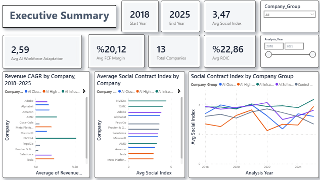
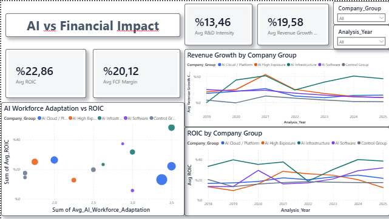
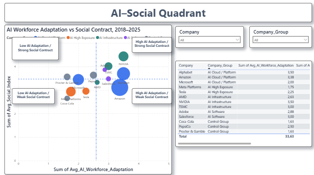
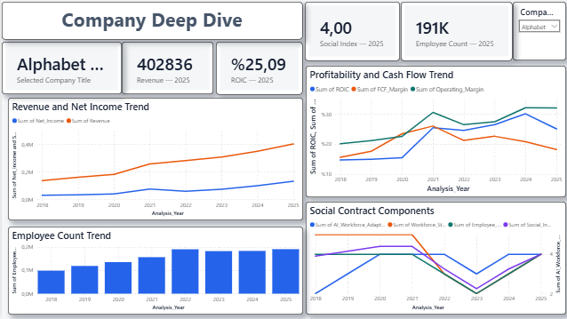

# AI Transformation, Financial Performance & Workforce Analytics

An end-to-end SQL Server and Power BI project examining the relationship between AI transformation, financial performance, workforce outcomes, and the employee social contract across 13 global companies from 2018 to 2025.

> This project identifies comparative patterns and associations. It does not claim that AI transformation directly caused the observed financial or workforce outcomes.

---

## Project Overview

This project analyzes how AI-driven transformation interacted with:

- Revenue growth and profitability
- ROIC and free cash flow generation
- R&D and capital expenditure intensity
- Employee growth and workforce stability
- AI workforce adaptation
- Employee trust and the broader employee social contract

The final dataset contains:

- **13 companies**
- **8 analysis years**
- **104 company-year observations**
- **7 Power BI report pages**

---

## Research Question

**What patterns emerged between AI transformation intensity, financial performance, and the employee social contract across global companies between 2018 and 2025?**

---

## Companies Included

### AI Infrastructure
- NVIDIA
- AMD
- TSMC

### AI Cloud / Platform
- Microsoft
- Alphabet
- Amazon

### AI Software
- Adobe
- Salesforce

### AI High Exposure
- Meta Platforms
- Tesla

### Control Group
- Coca-Cola
- PepsiCo
- Procter & Gamble

---

## Tools and Technologies

- **SQL Server** — data cleaning, validation, financial calculations, and analytical views
- **Power BI** — data modeling, DAX measures, and interactive dashboards
- **Excel / CSV** — source consolidation and quality checks
- **SEC filings and annual reports** — primary financial and workforce evidence
- **GitHub** — project documentation and portfolio presentation

---

## Dashboard Pages

1. **Executive Summary**
2. **AI vs Financial Impact**
3. **Company Comparison**
4. **Social Contract Analysis**
5. **AI–Social Quadrant**
6. **Company Deep Dive**
7. **Sources & Methodology**

---

## Dashboard Preview

### Executive Summary



### AI vs Financial Impact



### AI–Social Quadrant



### Company Deep Dive



---

## Dataset

The row-level dataset includes financial, workforce, and analytical variables such as:

- Revenue
- Net income
- Operating income
- Operating cash flow
- Free cash flow
- Assets and equity
- Cash and debt
- R&D expense
- CapEx
- Employee count
- Revenue growth
- Employee growth
- ROIC
- ROE
- FCF margin
- R&D intensity
- CapEx intensity
- Workforce Stability Score
- AI Workforce Adaptation Score
- Employee Trust / Social Contract Score
- Social Contract Index

### Time Standardization

Companies use different fiscal-year calendars. To support cross-company comparison, the project uses **Analysis Year** as the common time dimension while retaining fiscal-year and period-end fields for traceability.

---

## Social Contract Methodology

The employee social contract was assessed using three dimensions:

1. **Workforce Stability**
2. **AI Workforce Adaptation**
3. **Employee Trust and Social Contract**

Each dimension was scored on a **0–5 scale** using documented company disclosures and traceable external evidence.

### Social Contract Index

```text
Social Contract Index =
0.40 × Workforce Stability
+ 0.25 × AI Workforce Adaptation
+ 0.35 × Employee Trust and Social Contract
```

Undisclosed information was recorded as blank or N/A. Employee counts, training figures, and restructuring values were not estimated.

---

## Key Findings

- AI Infrastructure companies generally displayed some of the strongest revenue growth and R&D intensity in the sample.
- High AI workforce adaptation did not consistently correspond to high ROIC across all companies.
- Financial performance and employee social-contract outcomes varied significantly across company groups.
- Restructuring and workforce contraction periods often coincided with weaker workforce-stability or trust scores in several companies.
- Some companies demonstrated that strong AI adaptation and a relatively strong employee social contract can coexist.
- The relationship between AI transformation and workforce outcomes was heterogeneous rather than uniform.

---

## Interpretation

The analysis suggests that AI transformation is not associated with a single, consistent financial or workforce outcome.

Some companies combined:

- High AI adaptation
- Strong revenue growth
- Strong profitability
- Relatively strong workforce outcomes

Others showed:

- High AI exposure
- Organizational restructuring
- Workforce contraction
- More volatile social-contract scores

These patterns should be interpreted as **associations and comparative evidence**, not as proof of causality.

---

## Data Sources

Primary sources were prioritized:

1. SEC Form 10-K and Form 20-F filings
2. Company annual reports
3. Sustainability, ESG, and impact reports
4. Investor relations materials
5. Official company statements and press releases

Reputable external reporting was used when official disclosures did not provide sufficient workforce or restructuring context.

Approved external sources included Reuters, Associated Press, CNBC, Bloomberg, Financial Times, and The Wall Street Journal.

Employee review websites, forums, blogs, and unverified social-media sources were excluded.

---

## Repository Structure

```text
ai-transformation-workforce-analytics/
│
├── README.md
│
├── assets/
│   ├── executive-summary.png
│   ├── financial-impact.png
│   ├── ai-social-quadrant.png
│   └── company-deep-dive.png
│
├── data/
│   └── Final_AI_Impact_Data.csv
│
└── powerbi/
    ├── AI_Transformation_Workforce_Analytics_Final.pbix
    └── AI_Transformation_Portfolio_Theme.json
```

---

## How to Use

### Option 1 — Open the Interactive Power BI Report

Open:

```text
powerbi/AI_Transformation_Workforce_Analytics_Final.pbix
```

Power BI Desktop is required. Depending on the local environment, the data-source connection may need to be updated.

### Option 2 — Explore the Final Dataset

Open:

```text
data/Final_AI_Impact_Data.csv
```

### Option 3 — Review Dashboard Images

The `assets` folder contains selected dashboard screenshots used in this README.

---

## Limitations

- The analysis is observational and does not establish causality.
- Companies operate in different industries and have different business models.
- Disclosure depth varies across companies and years.
- Social-contract scores are evidence-based analytical assessments rather than company-reported accounting measures.
- Major events such as acquisitions, restructuring charges, tax effects, macroeconomic shocks, and fiscal-calendar differences may influence individual-year results.
- Some workforce and AI-training information was not consistently disclosed.

---

## Future Development

Potential extensions include:

- Difference-in-Differences analysis
- Company and year fixed-effects regression
- Sector-matched control groups
- Event-study analysis around major AI announcements
- Expanded employee-training and restructuring variables
- Direct integration with Power BI Service

---

## Portfolio Skills Demonstrated

- SQL data cleaning and transformation
- Financial statement analysis
- DAX measure development
- Power BI data modeling
- Dashboard design
- Comparative company analysis
- Source validation
- Research methodology
- Data storytelling

---

## Author

**Orçun Günhan**

Business and data analytics portfolio project focused on the intersection of AI transformation, financial performance, and workforce outcomes.
